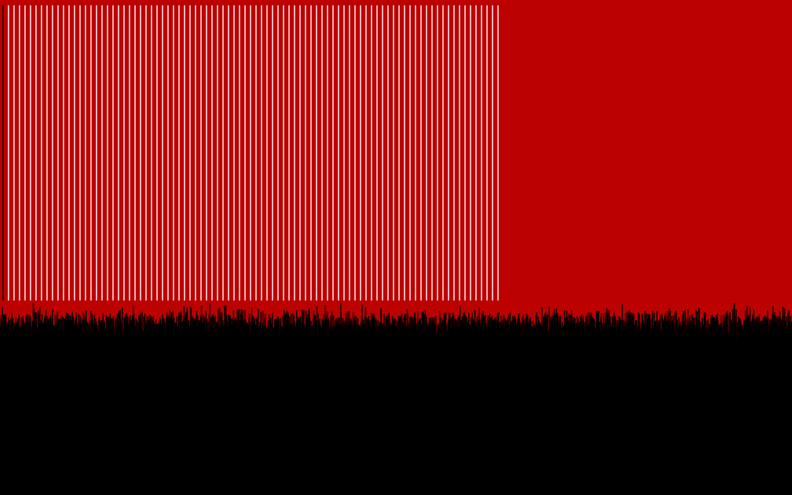

# ProcessingSketchesFhp
## Project // 1 Follow Mouse

A group of three ellipses follow the mouse. Press left click to change the color from pink to cyan.
## Project // 2 Noise and Color Random

Noise generation and lines will follow the position of the mouse. Press left click to change color of the noise. Random color Background.
## Project // 3 Growing 3D Sphere

Generation of a 3D sphere while moving the mouse from left to right. Several ellipses grow in the background. Press right click, the sphere changes its color.
